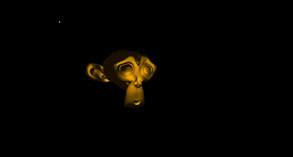
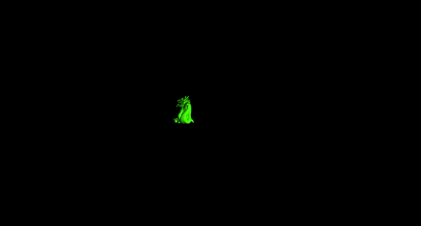

# Model Viewer

Model Viewer built for CSC 305 class in OpenGL

## Preview

## Features 

- [x] Directional Light
- [x] Specular Reflection
- [x] Specular Shading with Multiple Light sources
- [x] First-Person View Camera
- [x] Loads a simple mesh

